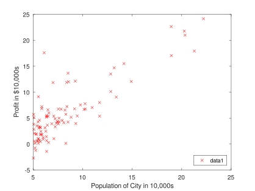
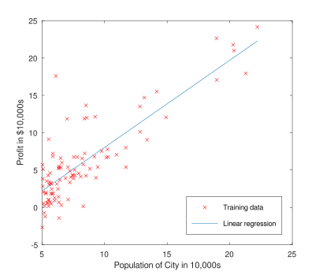
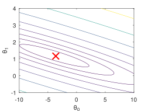
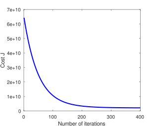

# Lab 1 - Linear Regression - Julia

[[Home](../../../README.md) | [Back](../README.md)]

## Contents <!-- omit in toc -->

- [Lab 1 - Linear Regression - Julia](#lab-1---linear-regression---julia)
  - [Included Files](#included-files)
    - [Where To Get Help](#where-to-get-help)
  - [A Simple Julia Function](#a-simple-julia-function)
  - [1 - Linear Regression With One Variable](#1---linear-regression-with-one-variable)
    - [1.1 - Plotting The Data](#11---plotting-the-data)
    - [1.2 - Gradient Descent](#12---gradient-descent)
      - [1.2.1 - Implementation](#121---implementation)
      - [1.2.2 - Computing The Cost](#122---computing-the-cost)
      - [1.2.3 - Computing Gradient Descent](#123---computing-gradient-descent)
    - [1.3 - Debugging](#13---debugging)
    - [1.4 - Visualizing The Cost](#14---visualizing-the-cost)
  - [2 - Linear Regression With Multiple Variables](#2---linear-regression-with-multiple-variables)
    - [2.1 - Feature Normalization](#21---feature-normalization)
    - [2.2 - Gradient Descent](#22---gradient-descent)
      - [2.2.1 - Selecting Learning Rates](#221---selecting-learning-rates)
    - [2.3 - Normal Equations](#23---normal-equations)

## Included Files

[[Top](#lab-1---linear-regression---julia) | [Back](../README.md) | [Home](../../../README.md)]

```tree
lab_01/
├── lab1data1.txt - Dataset for linear regression with one variable
├── lab1data2.txt - Dataset for linear regression with multiple variables
├── README.md - General description of this lab
└── julia/
    ├── solution1
    │   ├── warmUpExercise.jl - Simple example function in Julia
    │   ├── plotData.jl - Function to display the dataset
    │   ├── computeCost.jl - Function to compute the cost of linear regression
    │   └── gradientDescent.jl - Function to run gradient descent
    ├── solution2
    │   ├── computeCostMulti.jl - Cost function for multiple variables
    │   ├── gradientDescentMulti.jl - Gradient descent for multiple variables
    │   ├── featureNormalize.jl - Function to normalize features
    │   └── normalEqn.jl - Function to compute the normal equations
    ├── exercise1.jl - Julia script that steps you through the first exercise
    ├── exercise2.jl - Julia script for the second exercise
    ├── README.md - Julia specific information - THIS FILE
    ├── [1] computeCost.jl - Function to compute the cost of linear regression
    ├── [2] computeCostMulti.jl - Cost function for multiple variables
    ├── [2] featureNormalize.jl - Function to normalize features
    ├── [1] gradientDescent.jl - Function to run gradient descent
    ├── [2] gradientDescentMulti.jl - Gradient descent for multiple variables
    ├── [2] normalEqn.jl - Function to compute the normal equations
    ├── [1] plotData.jl - Function to display the dataset
    └── [1] warmUpExercise.jl - Simple example function in Julia
```

This lab is composed of two exercises, `exercise1.jl`, which covers linear regression with one variable, and `exercise2.jl`, which extends linear regression to multiple variables. You only need to modify the files indicated by either `[1]`, for those files used by exercise 1, or `[2]`, for those used by exercise 2. Solutions are provided for each corresponding exercise.

### Where To Get Help

[[Top](#lab-1---linear-regression---julia) | [Back](../README.md) | [Home](../../../README.md)]

You can use either Octave or MATLAB to complete this lab. Octave is a free alternative to MATLAB. Both are high-level programming languages, well suited for numerical computations. If you wish to use either of these environments but have not installed them yet, see [Lab 0](../../lab_00/README.md), which includes instructions for [Octave](../../lab_00/julia.md).

Information on functions is available from within the Julia GUI by typing `help [function_name]` at the prompt. For example, `help plot` provides information on plotting. Further information for Octave functions can be found in the [Octave Documentation](http://www.gnu.org/software/julia/doc/interpreter/). Similarly, additional MATLAB information is at [MATLAB Documentation](http://www.mathworks.com/help/matlab/?refresh=true).

## A Simple Julia Function

[[Top](#lab-1---linear-regression---julia) | [Back](../README.md) | [Home](../../../README.md)]

The first part of Exercise 1 is to become familiar with Julia syntax. In the file `warmUpExercise.jl`, you'll find the outline of a simple Julia function. Modify the section, indicated in the file, to create a 5 X 5 identity matrix by adding the following code

```julia
A = eye(5);
```

When you've finished, you can run `exercise1.jl` by either loading `exercise1.jl` into VS Code and pressing `Ctrl + Shift + Enter` (`Command + Shift + Emter` on Mac), or by openning a terminal, and running

```bash
cd labs/lab_01/julia
julia exercise1.m
```

The first command changes directory to the `julia` folder under `lab_01`. If you're not sure that you're in the proper folder, you can run

```bash
pwd             # should display [This repo's location]/labs/lab_01/julia
ls exercise1.jl # should list the file exercise1.m
```

After executing `exercise1.jl`, you should see

```text
Running warmUpExercise ...
5x5 Identity Matrix:
ans =

Diagonal Matrix

   1   0   0   0   0
   0   1   0   0   0
   0   0   1   0   0
   0   0   0   1   0
   0   0   0   0   1

Program paused. Press enter to continue.
```

`exercise1.jl` will pause until you press any key, then it will run the code for the next part of the assignment. If you wish to quit, type `ctrl-c` to stop the program in the middle of its run.

**Try running your code now**

## 1 - Linear Regression With One Variable

[[Top](#lab-1---linear-regression---julia) | [Back](../README.md) | [Home](../../../README.md)]

In the second part of Exercise 1, you will implement linear regression with one variable to predict profits for a food truck. Suppose you're the owner of a fleet of food trucks, and are considering different cities to open a new location. The fleet is already active in other cities, for which you have profit and population data. You'd like to use this data to select where you should expand to next.

The file, `lab1data1.txt`, contains the dataset for this exercise. Each row represents the data from a city. The first column is that city's population, while the second column is the profit from a food truck in that city. A negative profit value indicates a loss. `exercise1.jl` is already set up to load this data for you.

### 1.1 - Plotting The Data

[[Top](#lab-1---linear-regression---julia) | [Back](../README.md) | [Home](../../../README.md)]

When faced with any task involving data analysis, it is immensely useful to first visualize the data. This gives you a better understanding of the data, and may provide intuitions about what information we're attempting to derive from it. For this dataset, we'll use a scatter plot, since this data only has two properties, population and profit. More often, the number of properties exceed what can be displayed in a two dimensional plot.

`exercise1.jl` loads the dataset from `lab1data1.txt` into the variable `X` and `y`:

```julia
data = load('../lab1data1.txt'); % read comma-separated data
X = data(:, 1); y = data(:, 2);
m = length(y);                   % number of training examples
```

Next, the script calls `plotData` to create a scatter plot of the data. Your job is to complete `plotData.jl` to draw the plot. Modify the file and fill in the following code:

```julia
plot(x, y, 'rx', 'MarkerSize', 10);      % Plot the data
ylabel('Profit in $10,000s');            % Set the y−axis label
xlabel('Population of City in 10,000s'); % Set the x−axis label
```

When you continue to run `exercise.jl`, you should see a plot similar to [Figure 1](#fig-1), with the same red 'x' markers, axis labels and legend. To learn more about the `plot` command, you can type `help plot` at the Julia command prompt, or search online for plotting documentation. To change the markers to red “x”, we used the option ‘rx’ together with the plot command, in other words:

```julia
plot(..,[your options here],.., ‘rx’);
```

<figure id="fig-1">
  
  <figcaption>Figure 1: Scatter plot of training data</figcaption>
</figure>

### 1.2 - Gradient Descent

[[Top](#lab-1---linear-regression---julia) | [Back](../README.md) | [Home](../../../README.md)]

In this section of Exercise 1, you will fit the linear regression parameters, $\theta$, to our dataset using gradient descent. The objective of linear regression is to fit a line to our data. By that, we mean that the *normal* distance, the distance perpendicular to the line to each data point in our dataset, is minimized. To do that, we create a cost function

$$
J(\theta) = \frac{1}{2m}\sum_{i=1}^{m}(h_{\theta}(x^{(i)})-y^{(i)})^2
$$

where the hypothesis, $h_{\theta}(x)$, is given by the linear model

$$
h_{\theta}(x) = \theta^Tx = \theta_0 + \theta_1x_1
$$

Remember that the parameters of your model are the $\theta_j$ values. You will adjust these values to minimize the cost function, $J(\theta)$. One way to do that is with the batch gradient descent algorithm. In that algorithm, each iteration performs the update

$$
\theta_j= \theta_j - \alpha\frac{1}{m}\sum_{i=1}^{m}(h_{\theta}(x^{(i)})-y^{(i)})x_j^{(i)}
$$

simultaneously updating $\theta_j$ for all $j$. With each step of the gradient descent, your parameters, $\theta_j$, come closer to the optimal values that will achieve the lowest cost, $J(\theta)$.

#### 1.2.1 - Implementation

[[Top](#lab-1---linear-regression---julia) | [Back](../README.md) | [Home](../../../README.md)]

Note that we store each example as a row in the `X` matrix. To take into account the intercept term, $\theta_0$, we add an additional first column to `X` and set it to all ones. This allows us to treat $\theta_0$ as simply another 'feature'. In the following lines, we add another dimension to our data to accommodate the $\theta_0$ intercept term. We also initialize the initial parameters to 0, and set the learning rate, $\alpha$ = 0.01.

```julia
X = [ones(m, 1), data(:,1)]; % Add a column of ones to x
theta = zeros(2, 1);         % initialize fitting parameters

iterations = 1500;
alpha = 0.01;
```

#### 1.2.2 - Computing The Cost

[[Top](#lab-1---linear-regression---julia) | [Back](../README.md) | [Home](../../../README.md)]

As you perform gradient descent to learn the minimization of the cost function $J(\theta)$, it is helpful to monitor the convergence by computing the cost. In this section, you will implement a function to calculate $J(\theta)$ so you can check the convergence of your gradient descent implementation.

Your next task is to complete the code in the file `computeCost.jl`, which is a function that computes $J(\theta)$. As you are doing this, remember that the variables `X` and `y` are not scalar values, but matrices whose rows represent the examples from the training set.

Once you have completed the function, the next step in `exercise1.jl` will run `computeCost` once using $\theta$ initialized to zeros, and you will see the cost printed to the screen. You should expect to see a cost of 32.07.

**Try running your code now**

#### 1.2.3 - Computing Gradient Descent

[[Top](#lab-1---linear-regression---julia) | [Back](../README.md) | [Home](../../../README.md)]

Next, you will implement gradient descent in the file `gradientDescent.jl`. The loop structure has been written for you. You only need to supply the updates to $\theta$ within each iteration.

As you program, make sure you understand what you are trying to optimize, and what is being updated. Keep in mind that the cost, $J(\theta)$ is parameterized by the vector $\theta$, not `X` and `y`. That is, we minimize the value of $J(\theta)$ by changing the values of the vector $\theta$, not by changing `X` or `y`. Refer to the equations in this handout and in Chapter 3 if you are uncertain.

A good way to verify that gradient descent is working correctly is to look at the value of $J(\theta)$ and check that it is decreasing with each step. The starter code for `gradientDescent.jl` calls `computeCost` on every iteration and prints the cost. Assuming you have implemented gradient descent and `computeCost` correctly, your value of $J(\theta)$ should never increase, and should converge to a steady value by the end of the algorithm.

After you are finished, `exercise1.jl` will use your final parameters to plot the linear fit. The result should look something like [Figure 2](#fig-2).

Your final values for $\theta$ will also be used to make predictions on profits in areas of 35,000 and 70,000 people. Note the way that the following lines in `exercise1.jl` uses matrix multiplication, rather than explicit summation or looping, to calculate the predictions. This is an example of code vectorization in Julia.

**Try running your code now**

### 1.3 - Debugging

[[Top](#lab-1---linear-regression---julia) | [Back](../README.md) | [Home](../../../README.md)]

Here are some things to keep in mind as you implement gradient descent.

* Julia array indices start from one, not zero. If you’re storing $\theta_0$ and $\theta_1$ in a vector called `theta`, the values will be `theta(1)` and `theta(2)`.
* If you are seeing many errors at runtime, inspect your matrix operations to make sure that you’re adding and multiplying matrices of compatible dimensions. Printing the dimensions of variables with the `size` command will help you debug.

<figure id="fig-2">
  
  <figcaption>Figure 2: Training data with fitted line</figcaption>
</figure>

* By default, Julia interprets math operators to be matrix operators. This is a common source of size incompatibility errors. If you don’t want matrix multiplication, you need to add the “dot” notation to specify this to Julia. For example, `A*B` does a matrix multiply, while `A.*B` does an element-wise multiplication.

### 1.4 - Visualizing The Cost

[[Top](#lab-1---linear-regression---julia) | [Back](../README.md) | [Home](../../../README.md)]

To understand the cost function $J(\theta)$ better, you will now plot the cost over a 2-dimensional grid of $\theta_0$ and $\theta_1$ values. You will not need to code anything new for this part, but you should understand how the code you have written already is creating these images.

In the next step of `exercise1.jl`, there is code set up to calculate $J(\theta)$ over a grid of values using the `computeCost` function that you wrote.

```julia
% initialize J vals to a matrix of 0's
J vals = zeros(length(theta0 vals), length(theta1 vals));

% Fill out J vals
for i = 1:length(theta0 vals)
    for j = 1:length(theta1 vals)
        t = [theta0 vals(i); theta1 vals(j)];
        J vals(i,j) = computeCost(x, y, t);
    end
end
```

After these lines are executed, you will have a 2-D array of $J(\theta)$ values. The script `exercise1.jl` will then use these values to produce surface and contour plots of $J(\theta)$ using the surf and contour commands. The plots should look something like [Figure 3](#fig-3)

<figure id="fig-3">
<table>
  <tr>
    <td><br><center>(a) Surface</center></td>
    <td><br><center>(b) Contour, showing minimum</center></td>
  </tr>
</table>
<figcaption>Figure 3: Cost Function</figcaption>
</figure>

The purpose of these graphs is to show you how $J(\theta)$ varies with changes in $\theta_0$ and $\theta_1$. The cost function $J(\theta)$ is bowl-shaped and has a global minimum. This is easier to see in the contour plot than in the 3D surface plot. This minimum is the optimal point for $\theta_0$ and $\theta_1$, and each step of gradient descent moves closer to this point.

## 2 - Linear Regression With Multiple Variables

[[Top](#lab-1---linear-regression---julia) | [Back](../README.md) | [Home](../../../README.md)]

If you have successfully completed the material above, congratulations! You now understand linear regression and should able to start using it on your own datasets.

This exercise will help you gain a deeper understanding of the material by extending the concept of linear regression across multiple variables. This is very often the case in today's data-driven world. In this exercise, we will consider multiple variables to predict the price of houses. Suppose you are selling your house and would like to know what a good market price would be. One way to do this is to collect information on recent houses sold, and make a model of housing prices.

The file `lab1data2.txt` contains a training set of housing prices in Portland, Oregon. The first column is the size of the house in square feet, the second column is the number of bedrooms, and the third column is the price of the house. The script, `exercise2.jl`, has been set up to help you step through this exercise.

### 2.1 - Feature Normalization

[[Top](#lab-1---linear-regression---julia) | [Back](../README.md) | [Home](../../../README.md)]

The script, `exercise2.jl`, will start by loading and displaying some values from this dataset. By looking at the values, note that house sizes are about 1000 times the number of bedrooms. When features differ by orders of magnitude, performing feature scaling first can make gradient descent converge much more quickly.

Your task here is to complete the code in `featureNormalize.jl` to

* Subtract the mean value of each feature from the dataset.
* After subtracting the mean, additionally scale (divide) the feature values by their respective “standard deviations.”

Standard deviation is a way of measuring how much variation there is in the range of values of a particular feature. Most data points will lie within ±2 standard deviations of the mean. This is an alternative to taking the range of values using max-min. In Julia, you can use the `std` function to compute the standard deviation. For example, inside `featureNormalize.jl`, the quantity `X(:,1)` contains all the values of $x_1$ (house sizes) in the training set, so `std(X(:,1))` computes the standard deviation of the house sizes.  At the time that `featureNormalize.jl` is called, the extra column of 1’s corresponding to $x_0 = 1$ has not yet been added to `X`. See `exercise2.jl` for details.

You will do this for all the features and your code should work with datasets of all sizes (any number of features / examples). Note that each column of the matrix `X` corresponds to one feature.

When normalizing the features, it is important to store the values used for normalization: the mean value and the standard deviation used for the computations. After learning the parameters from the model, we often want to predict the prices of houses we have not seen before. Given a new `x` value, representing the square footage and number of bedrooms, we must first normalize `x` using the mean and standard deviation that we had previously computed from the training set.

**Try running your code now**

### 2.2 - Gradient Descent

[[Top](#lab-1---linear-regression---julia) | [Back](../README.md) | [Home](../../../README.md)]

Previously, you implemented gradient descent on a univariate regression problem. The only difference now is that there is one more feature in the matrix `X`. The hypothesis function and the batch gradient descent update rule remain unchanged.

You should complete the code in `computeCostMulti.jl` and `gradientDescentMulti.jl` to implement the cost function and gradient descent for linear regression with multiple variables. If your code in the first exercise already supports multiple variables, you can use it here too.

Make sure your code supports any number of features and is well-vectorized.  You can use `size(X, 2)` to find out how many features are present in the dataset.

**Try running your code now**

In the multivariate case, the cost function can also be written in the following vectorized form:

$$
J(\theta) = \frac{1}{2m}(X\theta - y)^T(X\theta - y)
$$

where

$$
X = \begin {bmatrix}
\text{---} & (x^{(1)})^T & \text{---} \\
\text{---} & (x^{(2)})^T & \text{---} \\
  & \vdots &  \\
\text{---} & (x^{(m)})^T & \text{---} \\
\end {bmatrix}, \quad
y = \begin {bmatrix}
(y^{(1)}) \\
(y^{(2)}) \\
\vdots \\
(y^{(m)}) \\
\end {bmatrix}
$$

The vectorized version is efficient when you’re working with numerical computing tools like Julia. If you are an expert with matrix operations, you can prove to yourself that the two forms are equivalent.

#### 2.2.1 - Selecting Learning Rates

[[Top](#lab-1---linear-regression---julia) | [Back](../README.md) | [Home](../../../README.md)]

In this part of the exercise, you will get to try out different learning rates for the dataset and find a learning rate that converges quickly. You can change the learning rate by modifying `exercise2.jl` and changing the part of the code that sets the learning rate.

The next phase in `exercise2.jl` will call your `gradientDescent.jl` function and run gradient descent for about 50 iterations at the chosen learning rate. The function should also return the history of $J(\theta)$ values in a vector `J`. After the last iteration, the `exercise2.jl` script plots the `J` values against the number of the iterations.

If you picked a learning rate within a good range, your plot look similar to [Figure 4](#fig-4). If your graph looks very different, especially if your value of $J(\theta)$ increases or even blows up, adjust your learning rate and try again. We recommend trying values of the learning rate $\alpha$ on a log-scale, at multiplicative steps of about 3 times the previous value (i.e., 0.3, 0.1, 0.03, 0.01 and so on). You may also want to adjust the number of iterations you are running if that will help you see the overall trend in the curve.

<figure id="fig-4">
  
  <figcaption>Figure 4: Convergence of gradient descent with an appropriate learning rate</figcaption>
</figure>

If your learning rate is too large, $J(\theta)$ can diverge and ‘blow up’, resulting in values which are too large for computer calculations. In these situations, Julia will tend to return `NaN`s. `NaN` stands for ‘not a number’ and is often caused by undefined operations that involve $−\infty$ and $+\infty$.

To compare how different learning rates affect convergence, it’s helpful to plot `J` for several learning rates on the same figure. In Julia, this can be done by performing gradient descent multiple times with a `hold on` command between plots. Concretely, if you’ve tried three different values of $\alpha$ (you should probably try more values than this) and stored the costs in `J1`, `J2` and `J3`, you can use the following commands to plot them on the same figure:

```julia
plot(1:50, J1(1:50), ‘b’);
hold on;
plot(1:50, J2(1:50), ‘r’);
plot(1:50, J3(1:50), ‘k’);
```

The final arguments ‘b’, ‘r’, and ‘k’ specify different colors for the plots.

Notice the changes in the convergence curves as the learning rate changes. With a small learning rate, you should find that gradient descent takes a very long time to converge to the optimal value. Conversely, with a large learning rate, gradient descent might not converge or might even diverge!

Using the best learning rate that you found, use the `exercise2.jl` script to run gradient descent until convergence to find the final values of $\theta$. Next, use this value of $\theta$ to predict the price of a house with 1650 square feet and 3 bedrooms. You will use this value later to check your implementation of the normal equations. Don’t forget to normalize your features when you make this prediction!

### 2.3 - Normal Equations

[[Top](#lab-1---linear-regression---julia) | [Back](../README.md) | [Home](../../../README.md)]

In Chapter 3, we learned that the closed-form solution to linear regression is

$$
\theta = (X^TX)^{-1}X^Ty
$$

This formula requires no feature scaling, and you get a solution in only one calculation. Unlike gradient descent, there is no need to converge to a solution. Complete the code in `normalEqn.jl` to use the above formula to calculate $\theta$. Remember that, while you don't need to scale your features, you do need to add a column of 1's to the `X` matrix to have an intercept term, $\theta_0$. The code in `exercise1.jl` will add the column of 1's to `X` for you.

**Try running your code now**

Once you have found $\theta$ using this method, use it to make a price prediction for a 1650-square-foot house with 3 bedrooms. You should find that gives the same predicted price as the value you obtained using the model fit with gradient descent in Section [2.2.1](#221---selecting-learning-rates).