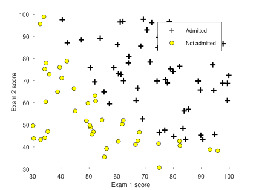
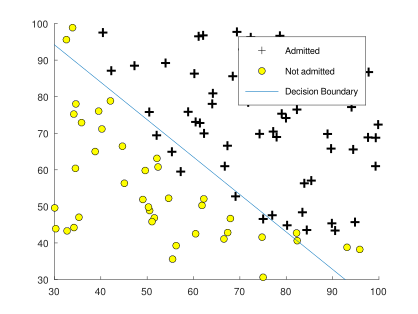
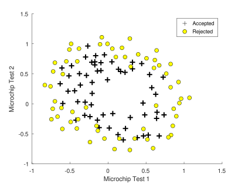
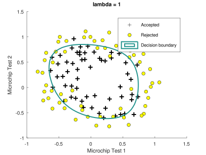
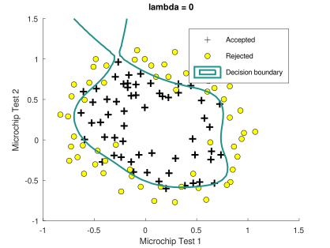
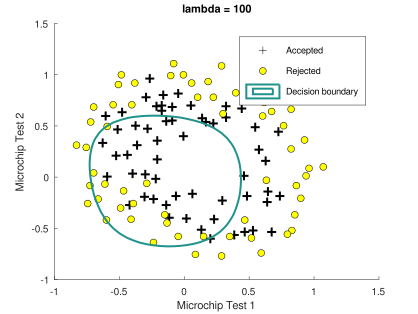

# **Lab 2 - Logistic Regression - MATLAB/Octave**

[[Home](../../../README.md) | [Back](../README.md)]

## **Contents** <!-- omit from toc -->

- [**Lab 2 - Logistic Regression - MATLAB/Octave**](#lab-2---logistic-regression---matlaboctave)
  - [**Included Files**](#included-files)
    - [**Where To Get Help**](#where-to-get-help)
  - [**1 Logistic Regression**](#1-logistic-regression)
    - [**1.1 Visualizing the data**](#11-visualizing-the-data)
    - [**1.2 Implementation**](#12-implementation)
      - [**1.2.1 Warmup exercise: sigmoid function**](#121-warmup-exercise-sigmoid-function)
      - [**1.2.2 Cost function and gradient**](#122-cost-function-and-gradient)
      - [**1.2.3 Learning parameters using** `fminunc`](#123-learning-parameters-using-fminunc)
      - [**1.2.4 Evaluating logistic regression**](#124-evaluating-logistic-regression)
  - [**2 Regularized logistic regression**](#2-regularized-logistic-regression)
    - [**2.1 Visualizing the data**](#21-visualizing-the-data)
    - [**2.2 Feature mapping**](#22-feature-mapping)
    - [**2.3 Cost function and gradient**](#23-cost-function-and-gradient)
      - [**2.3.1 Learning parameters using** `fminunc`](#231-learning-parameters-using-fminunc)
    - [**2.4 Plotting the decision boundary**](#24-plotting-the-decision-boundary)
    - [**2.5 Over- and Underfitting**](#25-over--and-underfitting)

## **Included Files**

[[Top](#lab-2---logistic-regression---matlaboctave) | [Back](../README.md) | [Home](../../../README.md)]

```tree
lab_02/
├── lab2data1.txt - Dataset for logistic regression with one variable
├── lab2data2.txt - Dataset for logistic regression with multiple variables
├── README.md - General description of this lab
└── octave/
    ├── solution1
    │   ├── costFunction.m - Function to compute the cost of linear regression
    │   ├── plotData.m - Function to display the dataset
    │   ├── predict.m - Predict the label using learned parameters
    │   └── sigmoid.m - Compute the sigmoid function
    ├── solution2
    │   ├── costFunctionReg.m - Regularized cost function
    │   ├── plotData.m - Function to display the dataset
    │   ├── predict.m - Predict the label using learned parameters
    │   └── sigmoid.m - Compute the sigmoid function
    ├── exercise1.m - Octave/MATLAB script that steps you through the first exercise
    ├── exercise2.m - Octave/MATLAB script for second exercise using regularization
    ├── mapFeature.m - Map feature function to polynomial features
    ├── plotDecisionBoundary.m - Plots data points with decision boundary
    ├── README.md - Octave/MATLAB specific information - THIS FILE
    ├── [1] costFunction.m - Function to compute the cost of linear regression
    ├── [2] costFunctionReg.m - Regularized cost function
    ├── [1,2] plotData.m - Function to display the dataset
    ├── [1,2] predict.m - Predict the label using learned parameters
    └── [1,2] sigmoid.m - Compute the sigmoid function
```

Throughout the exercise, you will be using the scripts `exercise1.m` and `exercise2.m` . These scripts set up the dataset for the problems and make calls to functions that you will write. You only need to modify the files indicated by either `[1]`, for those files used by exercise 1, or `[2]`, for those used by exercise 2. Solutions are provided for each corresponding exercise.

### **Where To Get Help**

[[Top](#lab-2---logistic-regression---matlaboctave) | [Back](../README.md) | [Home](../../../README.md)]

You can use either Octave or MATLAB to complete this lab. Octave is a free alternative to MATLAB. Both are high-level programming languages, well suited for numerical computations. If you wish to use either of these environments but have not installed them yet, see [Lab 0](../../lab_00/README.md), which includes instructions for [Octave](../../lab_00/octave.md).

Information on functions is available from within the Octave/MATLAB GUI by typing `help [function_name]` at the prompt. For example, `help plot` provides information on plotting. Further information for Octave functions can be found in the [Octave Documentation](http://www.gnu.org/software/octave/doc/interpreter/). Similarly, additional MATLAB information is at [MATLAB Documentation](http://www.mathworks.com/help/matlab/?refresh=true).

---

## **1 Logistic Regression**

[[Top](#lab-2---logistic-regression---matlaboctave) | [Back](../README.md) | [Home](../../../README.md)]

In this part of the exercise, you will build a logistic regression model to predict whether a student gets admitted into a university.

Suppose that you are the administrator of a university department and you want to determine each applicant’s chance of admission based on their results on two exams. You have historical data from previous applicants that you can use as a training set for logistic regression. For each training example, you have the applicant’s scores on two exams and the admissions decision.

Your task is to build a classification model that estimates an applicant’s probability of admission based the scores from those two exams. This outline and the framework code in `exercise1.m` will guide you through the exercise.

### **1.1 Visualizing the data**

[[Top](#lab-2---logistic-regression---matlaboctave) | [Back](../README.md) | [Home](../../../README.md)]

Before starting to implement any learning algorithm, it is always good to visualize the data if possible. In the first part of `ex2.m` , the code will load the data and display it on a 2-dimensional plot by calling the function `plotData` .

You will now complete the code in `plotData` so that it displays a figure like Figure 1, where the axes are the two exam scores, and the positive and negative examples are shown with different markers.

<figure id="fig-1">
  
  <figcaption>Figure 1: Scatter plot of training data</figcaption>
</figure>

To help you get more familiar with plotting, we have left `plotData.m` empty so you can try to implement it yourself. We also provide our implementation below so you can copy it or refer to it. If you choose to copy our example, make sure you learn what each of its commands is doing by consulting the Octave/MATLAB documentation.

```octave
% Find Indices of Positive and Negative Examples
pos = find(y==1); neg = find(y == 0);

% Plot Examples
plot(X(pos, 1), X(pos, 2), 'k+','LineWidth', 2, ...
    'MarkerSize', 7);
plot(X(neg, 1), X(neg, 2), 'ko', 'MarkerFaceColor', 'y', ...
    'MarkerSize', 7);
```

### **1.2 Implementation**

#### **1.2.1 Warmup exercise: sigmoid function**

[[Top](#lab-2---logistic-regression---matlaboctave) | [Back](../README.md) | [Home](../../../README.md)]

Before you start with the actual cost function, recall that the logistic regression hypothesis is defined as:

$$
h_\theta(x) = g(\theta^Tx)
$$

where function $g()$ is the sigmoid function. The sigmoid function is defined as:

$$
g(z) = \frac{1}{1 + e^{-z}}
$$

Your first step is to implement this function in `sigmoid.m` so it can be called by the rest of your program. When you are finished, try testing a few values by calling `sigmoid(x)` at the Octave/MATLAB command line. For large positive values of `x` , the sigmoid should be close to 1, while for large negative values, the sigmoid should be close to 0. Evaluating `sigmoid(0)` should give you exactly 0.5. Your code should also work with vectors and matrices. **For a matrix, your function should perform the sigmoid function on every element.**

_Try running your code now._

#### **1.2.2 Cost function and gradient**

[[Top](#lab-2---logistic-regression---matlaboctave) | [Back](../README.md) | [Home](../../../README.md)]

Now you will implement the cost function and gradient for logistic regression. Complete the code in `costFunction.m` to return the cost and gradient.

Recall that the cost function in logistic regression is

$$
J(\theta) = \frac{1}{m}\sum_{i=1}^{m}
\begin {bmatrix}
-y^{(i)}\operatorname{log}(h_\theta(x^{(i)})) - (1 - y^{(i)})\operatorname{log}(1 - h_\theta(x^{(i)}))
\end {bmatrix}
$$

and the gradient of the cost is a vector of the same length as $\theta$ where the $j^{th}$ element (for $j$ = 0,1,...,$n$ ) is defined as follows:

$$
\frac{\partial J(\theta)}{\partial \theta_j} = \frac{1}{m}\sum_{i=1}^{m}(h_\theta(x^{(i)}) - y^{(i)})x_j^{(i)}
$$

Note that while this gradient looks identical to the linear regression gradient, the formula is actually different because linear and logistic regression have different definitions of $h_\theta(x)$. Once you are done, `exercise1.m` will call your `costFunction` using the initial parameters of $\theta$. You should see that the cost is about 0.693.

_Try running your code now_

#### **1.2.3 Learning parameters using** `fminunc`

[[Top](#lab-2---logistic-regression---matlaboctave) | [Back](../README.md) | [Home](../../../README.md)]

In the previous assignment, you found the optimal parameters of a linear regression model by implementing gradient descent. You wrote a cost function and calculated its gradient, then took a gradient descent step accordingly. This time, instead of taking gradient descent steps, you will use an Octave/MATLAB built-in function called `fminunc`.

Octave/MATLAB’s `fminunc` is an optimization solver that finds the minimum of an unconstrained function. Constraints in optimization often refer to constraints on the parameters, like the constraints that bound the possible values that $\theta$ can take (e.g., $\theta \le 1$). Logistic regression does not have such constraints since $\theta$ is allowed to take any real value. Therefore, you want to optimize the cost function $J(\theta)$ with parameters $\theta$.

Concretely, you are going to use `fminunc` to find the best parameters $\theta$ for the logistic regression cost function, given a fixed dataset of $X$ and $y$ values. You will pass to `fminunc` the following inputs:

- The initial values of the parameters we are trying to optimize.
- A function that, when given the training set and a particular $\theta$, computes the logistic regression cost and gradient with respect to $\theta$ for the dataset $(X ,y)$

In `exercise1.m` , we already have code written to call `fminunc` with the correct arguments.

```octave
% Set options for fminunc
options = optimset('GradObj', 'on', 'MaxIter', 400);

% Run fminunc to obtain the optimal theta
% This function will return theta and the cost
[theta, cost] = ...
    fminunc(@(t)(costFunction(t, X, y)), initial theta, options);
```

In this code snippet, we first defined the options to be used with `fminunc`. Specifically, we set the `GradObj` option to `on` , which tells `fminunc` that our function returns both the cost and the gradient. This allows `fminunc` to use the gradient when minimizing the function. Furthermore, we set the `MaxIter` option to 400, so that `fminunc` will run for at most 400 steps before it terminates.

To specify the actual function we are minimizing, we use a “short-hand” for specifying functions with the `@(t) ( costFunction(t, X, y) )` . This creates a function, with argument `t` , which calls your costFunction. This allows us to wrap the `costFunction` for use with `fminunc` .

If you have completed the `costFunction` correctly, `fminunc` will converge on the right optimization parameters and return the final values of the cost and $\theta$. Notice that by using `fminunc`, you did not have to write any loops yourself, or set a learning rate like you did for gradient descent. This is all done by `fminunc`. You only need to provide a function calculating the cost and the gradient. Once `fminunc` completes, `exercise1.m` will call your `costFunction` function using the optimal parameters of $\theta$. You should see that the cost is about 0.203.

This final $\theta$ value will then be used to plot the decision boundary on the training data, resulting in a figure similar to Figure 2. We also encourage you to look at the code in `plotDecisionBoundary.m` to see how to plot such a boundary using the $\theta$ values.

<figure id="fig-2">
  
  <figcaption>Figure 2: Training data with decision boundary</figcaption>
</figure>

#### **1.2.4 Evaluating logistic regression**

[[Top](#lab-2---logistic-regression---matlaboctave) | [Back](../README.md) | [Home](../../../README.md)]

After learning the parameters, you can use the model to predict whether a particular student will be admitted. For a student with an Exam 1 score of 45 and an Exam 2 score of 85, you should expect to see an admission probability of 0.776.

Another way to evaluate the quality of the parameters we have found is to see how well the learned model predicts on our training set. In this part, your task is to complete the code in `predict.m`. The `predict` function will produce “1” or “0” predictions given a dataset and a learned parameter vector $\theta$. After you have completed the code in `predict.m` , the `exercise1.m` script will proceed to report the training accuracy of your classifier by computing the percentage of examples it got correct.

_Try running your code now_

## **2 Regularized logistic regression**

[[Top](#lab-2---logistic-regression---matlaboctave) | [Back](../README.md) | [Home](../../../README.md)]

In this part of the exercise, you will implement regularized logistic regression to predict whether microchips from a fabrication plant passes quality assurance (QA). During QA, each microchip goes through various tests to ensure it is functioning correctly.

Suppose you are the product manager of the factory and you have the test results for some microchips on two different tests. From these two tests, you would like to determine whether the microchips should be accepted or rejected. To help you make the decision, you have a dataset of test results on past microchips, from which you can build a logistic regression model.

You will use another script, `exercise2.m` to complete this portion of the exercise.

### **2.1 Visualizing the data**

[[Top](#lab-2---logistic-regression---matlaboctave) | [Back](../README.md) | [Home](../../../README.md)]

Similar to the previous parts of this exercise, `plotData` is used to generate a figure like Figure 3, where the axes are the two test scores, and the positive ( $y = 1$, accepted) and negative ( $y = 0$, rejected) examples are shown with different markers.

<figure id="fig-3">
  
  <figcaption>Figure 3: Scatter plot of training data</figcaption>
</figure>

Figure 3 shows that our dataset cannot be separated into positive and negative examples by a straight-line through the plot. Therefore, a straightforward application of logistic regression will not perform well on this dataset since logistic regression will only be able to find a linear decision boundary.

### **2.2 Feature mapping**

[[Top](#lab-2---logistic-regression---matlaboctave) | [Back](../README.md) | [Home](../../../README.md)]

One way to fit the data better is to create more features from each data point. In the provided function `mapFeature.m` , we will map the features into all polynomial terms of $x_1$ and $x_2$ up to the sixth power.

$$
\operatorname{mapFeature}(x) =
\begin {bmatrix}
1 \\
x_1 \\
x_2 \\
x_1^2 \\
x_1x_2 \\
x_2^2 \\
x_1^3 \\
\vdots \\
x_1x_2^5 \\
x_2^6
\end {bmatrix}
$$

As a result of this mapping, our vector of two features (the scores on two QA tests) has been transformed into a 28-dimensional vector. A logistic regression classifier trained on this higher-dimension feature vector will have a more complex decision boundary and will appear nonlinear when drawn in our 2-dimensional plot.

While the feature mapping allows us to build a more expressive classifier, it also more susceptible to overfitting. In the next parts of the exercise, you will implement regularized logistic regression to fit the data and also see for yourself how regularization can help combat the overfitting problem.

### **2.3 Cost function and gradient**

[[Top](#lab-2---logistic-regression---matlaboctave) | [Back](../README.md) | [Home](../../../README.md)]

Now you will implement code to compute the cost function and gradient for regularized logistic regression. Complete the code in `costFunctionReg.m` to return the cost and gradient. Recall that the regularized cost function in logistic regression is

$$
J(\theta) = \frac{1}{m}\sum_{i=1}^{m}
\begin {bmatrix}
-y^{(i)}\operatorname{log}(h_\theta(x^{(i)})) - (1 - y^{(i)})\operatorname{log}(1 - h_\theta(x^{(i)}))
\end {bmatrix} + \frac{\lambda}{2m}\sum_{j=1}^{n}\theta_j^2
$$

Note that you should not regularize the parameter $\theta_0$. In **Octave/MATLAB** , recall that indexing starts from 1, hence, you should not be regularizing the `theta(1)` parameter (which corresponds to $\theta_0$) in the code. The gradient of the cost function is a vector where the $j^{th}$ element is defined as follows:

$$
\frac{\partial J(\theta)}{\partial \theta_0} = \frac{1}{m}\sum_{i=1}^{m}(h_\theta(x^{(i)}) - y^{(i)})x_j^{(i)},\qquad\qquad\quad\;\;\; for\ j = 0 \\
\frac{\partial J(\theta)}{\partial \theta_j} =
\left(
\frac{1}{m}\sum_{i=1}^{m}(h_\theta(x^{(i)}) - y^{(i)})x_j^{(i)}
\right) + \frac{\lambda}{m}\theta_j,\quad for\ j > 0
$$

Once you are done, `exercise2.m` will call your `costFunctionReg` function using the initial value of $\theta$ (initialized to all zeros). You should see that the cost is about 0.693.

_Try running your code now_

#### **2.3.1 Learning parameters using** `fminunc`

[[Top](#lab-2---logistic-regression---matlaboctave) | [Back](../README.md) | [Home](../../../README.md)]

Similar to the previous parts, you will use `fminunc` to learn the optimal parameters $\theta$. If you have completed the cost and gradient for regularized logistic regression (`costFunctionReg.m`) correctly, you should be able to step through the next part of `exercise2.m` to learn the parameters $\theta$ using `fminunc`.

### **2.4 Plotting the decision boundary**

[[Top](#lab-2---logistic-regression---matlaboctave) | [Back](../README.md) | [Home](../../../README.md)]

To help you visualize the model learned by this classifier, we have provided the function `plotDecisionBoundary.m` which plots the (non-linear) decision boundary that separates the positive and negative examples. In `plotDecisionBoundary.m`, we plot the non-linear decision boundary by computing the classifier’s predictions on an evenly spaced grid and then draw a contour plot of where the predictions change from $y = 0$ to $y = 1$.

After learning the parameters $\theta$, the next step in `exercise2.m` will plot a decision boundary similar to Figure 4.

<figure id="fig-4">
  
  <figcaption>Figure 4: Training data with decision boundary</figcaption>
</figure>

### **2.5 Over- and Underfitting**

[[Top](#lab-2---logistic-regression---matlaboctave) | [Back](../README.md) | [Home](../../../README.md)]

In this part of the exercise, you will get to try out different regularization parameters for the dataset to understand how regularization prevents overfitting.

Notice the changes in the decision boundary as you vary $\lambda$. With a small $\lambda$, you should find that the classifier gets almost every training example correct, but draws a very complicated boundary, thus overfitting the data (Figure 5). This is not a good decision boundary. For example, it predicts that a point at $x = (−0.25, 1.5)$ is accepted ($y = 1$), which seems to be an incorrect decision given the training set.

With a larger $\lambda$, you should see a plot that shows an simpler decision boundary which still separates the positives and negatives fairly well. However, if $\lambda$ is set to too high a value, you will not get a good fit and the decision boundary will not follow the data so well, thus underfitting the data (Figure 6).

_Try running your code now_

<figure id="fig-5">
  
  <figcaption>Figure 5: No regularization (Overfitting)</figcaption>
</figure>

<figure id="fig-6">
  
  <figcaption>Figure 6: Too much regularization (Underfitting)</figcaption>
</figure>
