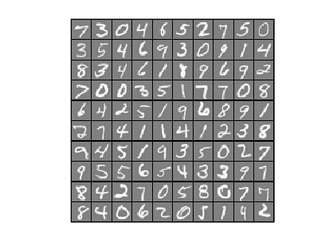
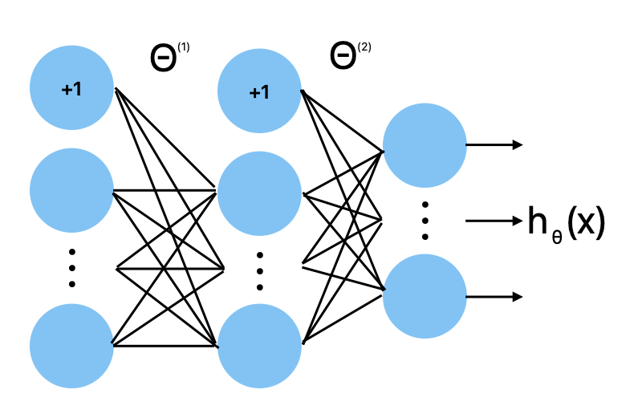

# Lab 3 - Neural Networks - MATLAB/Octave

[[Home](../../../README.md) | [Back](../../README.md)]

## Contents <!-- omit from toc -->

- [Lab 3 - Neural Networks - MATLAB/Octave](#lab-3---neural-networks---matlaboctave)
  - [Included Files](#included-files)
  - [**Where To Get Help**](#where-to-get-help)
- [**1 - Multi-class Classification**](#1---multi-class-classification)
  - [**1.1 - Dataset**](#11---dataset)
  - [**1.2 - Visualizing the Data**](#12---visualizing-the-data)
  - [**1.3 - Vectorizing Logistic Regression**](#13---vectorizing-logistic-regression)
    - [**1.3.1 - Vectorizing the cost function**](#131---vectorizing-the-cost-function)
    - [**1.3.2 - Vectorizing the gradient**](#132---vectorizing-the-gradient)
    - [**1.3.3 - Vectorizing regularized logistic regression**](#133---vectorizing-regularized-logistic-regression)
  - [**1.4 - One-vs-all Classification**](#14---one-vs-all-classification)
    - [**1.4.1 - One-vs-all Prediction**](#141---one-vs-all-prediction)
- [**2 - Neural Networks**](#2---neural-networks)
  - [**2.1 - Model representation**](#21---model-representation)
  - [**2.2 Feedforward Propagation and Prediction**](#22-feedforward-propagation-and-prediction)

## Included Files

[[Top](#lab-3---neural-networks---matlaboctave) | [Back](../README.md) | [Home](../../../README.md)]

```tree
lab_03/
├── lab3data1.mat - Training set of handwritten digits
├── lab3weights.mat - Initial weights for neural network
├── README.md - General description of this lab
└── octave/
    ├── solution1
    │   ├── lrCostFunction.m - Completed logistic regression cost function
    │   ├── oneVsAll.m - Completed first function of first exercise
    │   └── predictOneVsAll.m - Completed predictor of a label for a trained OneVsAll network
    ├── solution2
    │   ├── lrCostFunction.m - Completed logistic regression cost function
    │   ├── oneVsAll.m - Completed first function of first exercise
    │   └── predict.m - Completed predictor of label given trained neural network
    ├── displayData.m - Function to help visualize the data
    ├── exercise1.m - Octave script that steps you through the first exercise
    ├── exercise2.m - Octave script for the second exercise
    ├── fmincg.m - Function minimization routine (similar to fminunc)
    ├── [1,2] lrCostFunction.m - Skeleton for logistic regression cost function
    ├── [1,2] oneVsAll.m - Skeleton to train multiple classifiers
    ├── [2] predict.m - Skeleton to predict a label given a trained neural network
    ├── [1] predictOneVsAll.m - Skeleton to predict a label for a trained OneVsAll network
    ├── README.md - Octave specific information - THIS FILE
    └── sigmoid.m - Sigmoid function
```

Throughout the exercise, you will be using the scripts `exercise1.m` and `exercise2.m` . These scripts set up the dataset for the problems and make calls to functions that you will write. You only need to modify the files indicated by either `[1]`, for those files used by exercise 1, or `[2]`, for those used by exercise 2. Solutions are provided for each corresponding exercise.

## **Where To Get Help**

[[Top](#lab-3---neural-networks---matlaboctave) | [Back](../README.md) | [Home](../../../README.md)]

You can use either Octave or MATLAB to complete this lab. Octave is a free alternative to MATLAB. Both are high-level programming languages, well suited for numerical computations. If you wish to use either of these environments but have not installed them yet, see [Lab 0](../../lab_00/README.md), which includes instructions for [Octave](../../lab_00/octave.md).

Information on functions is available from within the Octave/MATLAB GUI by typing `help [function_name]` at the prompt. For example, `help plot` provides information on plotting. Further information for Octave functions can be found in the [Octave Documentation](http://www.gnu.org/software/octave/doc/interpreter/). Similarly, additional MATLAB information is at [MATLAB Documentation](http://www.mathworks.com/help/matlab/?refresh=true).

---

# **1 - Multi-class Classification**

[[Top](#lab-3---neural-networks---matlaboctave) | [Back](../README.md) | [Home](../../../README.md)]

For this lab, you will use logistic regression and neural networks to recognize handwritten digits from 0 to 9. Automated handwritten digit recognition is widely used today, from recognizing zip codes,or postal codes, on mail envelopes to recognizing amounts written on bank checks. This lab will show you how the methods you’ve learned can be used for this classification task.

In the first exercise of this lab, you will extend your previous implementation of logistic regression and apply it to one-vs-all classification.

## **1.1 - Dataset**

[[Top](#lab-3---neural-networks---matlaboctave) | [Back](../README.md) | [Home](../../../README.md)]

You are given a data set in `lab3data1.mat` that contains 5000 training examples of handwritten digits, taken from the [MNIST handwritten digit dataset](http://yann.lecun.com/exdb/mnist/). The `.mat` format means that that the data has been saved in a native Octave/MATLAB matrix format, instead of an ASCII text format like a csv-file. These matrices can be read directly into your program by using the `load` command. After loading, matrices of the correct dimensions and values will appear in your program’s memory. The matrix will already be named, so you do not need to assign names to them.

```octave
% Load saved matrices from file
load('ex3data1.mat');
% The matrices X and y will now be in your Octave environment
```

There are 5000 training examples in `lab3data1.mat` , where each training example is a 20 pixel by 20 pixel grayscale image of the digit. Each pixel is represented by a floating point number indicating the grayscale intensity at that location. The 20 by 20 grid of pixels is “unrolled” into a vector of length 400. Each of these training examples becomes a single row in our data matrix X. This gives us a 5000 by 400 matrix `X` where every row is a training example for a handwritten digit image.

$$
X =
\begin {bmatrix}
\text{---} & (x^{(1)})^T & \text{---} \\
\text{---} & (x^{(2)})^T & \text{---} \\
  & \vdots &  \\
\text{---} & (x^{(m)})^T & \text{---} \\
\end {bmatrix}
$$

The second part of the training set is a 5000-dimensional vector `y` that contains labels for the training set. To make things more compatible with Octave/MATLAB indexing, where there is no zero index, **we have mapped the digit zero to the value ten**. Therefore, a “0” digit is labeled as “10”, while the digits “1” to “9” are labeled as “1” to “9” in their natural order.

## **1.2 - Visualizing the Data**

[[Top](#lab-3---neural-networks---matlaboctave) | [Back](../README.md) | [Home](../../../README.md)]

You will begin by visualizing a subset of the training set. In Part 1 of `exercise1.m` , the code randomly selects selects 100 rows from `X` and passes those rows to the `displayData` function. This function maps each row to a 20 pixel by 20 pixel grayscale image and displays the images together. We have provided the `displayData` function, and you are encouraged to examine the code to see how it works. After you run this step, you should see an image like Figure 1.

<figure id="fig-1">
  
  <figcaption>Figure 1: Examples from the dataset</figcaption>
</figure>

## **1.3 - Vectorizing Logistic Regression**

[[Top](#lab-3---neural-networks---matlaboctave) | [Back](../README.md) | [Home](../../../README.md)]

You will be using multiple one-vs-all logistic regression models to build a multi-class classifier. Since there are 10 classes, you will need to train 10 separate logistic regression classifiers. To make this training efficient, it is important to ensure that your code is well vectorized. In this section, you will implement a vectorized version of logistic regression that does not employ any `for` loops. You can use your code in the last exercise as a starting point for this exercise.

### **1.3.1 - Vectorizing the cost function**

[[Top](#lab-3---neural-networks---matlaboctave) | [Back](../README.md) | [Home](../../../README.md)]

We will begin by writing a vectorized version of the cost function. Recall that in (unregularized) logistic regression, the cost function is

$$
J(\theta) = \frac{1}{m}\sum_{i=1}^{m}
\begin {bmatrix}
-y^{(i)}\operatorname{log}(h_\theta(x^{(i)})) -
(1 - y^{(i)})\operatorname{log}(1 - h_\theta(x^{{(i)}}))
\end {bmatrix}
$$

To compute each element in the summation, we have to compute $h_\theta(x^{(i)})$ for every example $i$, where $h_\theta(x^{(i)}) = g(\theta^Tx^{(i)})$ and $g(z) = \frac{1}{1 + e^{−z}}$ is the sigmoid function. It turns out that we can compute this quickly for all our examples by using matrix multiplication. Let us define $X$ and $\theta$ as

$$
X =
\begin {bmatrix}
\text{---} & (x^{(1)})^T & \text{---} \\
\text{---} & (x^{(2)})^T & \text{---} \\
  & \vdots &  \\
\text{---} & (x^{(m)})^T & \text{---} \\
\end {bmatrix}
\quad \operatorname{and} \quad
\theta =
\begin {bmatrix}
\theta_0 \\
\theta_1 \\
\vdots \\
\theta_n
\end {bmatrix}
$$

Then, by computing the matrix product $X\theta$, we have

$$
X\theta =
\begin {bmatrix}
\text{---} & (x^{(1)})^T\theta & \text{---} \\
\text{---} & (x^{(2)})^T\theta & \text{---} \\
  & \vdots &  \\
\text{---} & (x^{(m)})^T\theta & \text{---} \\
\end {bmatrix} =
\begin {bmatrix}
\text{---} & \theta^T(x^{(1)}) & \text{---} \\
\text{---} & \theta^T(x^{(2)}) & \text{---} \\
  & \vdots &  \\
\text{---} & \theta^T(x^{(m)}) & \text{---} \\
\end {bmatrix}
$$

In the last equality, we used the fact that $a^Tb = b^Ta$ if $a$ and $b$ are vectors. This allows us to compute the products $\theta^Tx^{(i)}$ for all our examples $i$ in one line of code.

Your job is to write the unregularized cost function in the file `lrCostFunction.m`. Your implementation should use the strategy we presented above to calculate $\theta^Tx^{(i)}$. You should also use a vectorized approach for the rest of the cost function. A fully vectorized version of `lrCostFunction.m` should not contain any loops.

(Hint: You might want to use the element-wise multiplication operation ( `.*` ) and the sum operation `sum` when writing this function)

### **1.3.2 - Vectorizing the gradient**

[[Top](#lab-3---neural-networks---matlaboctave) | [Back](../README.md) | [Home](../../../README.md)]

Recall that the gradient of the (unregularized) logistic regression cost is a vector where the $j^{th}$ element is defined as

$$
\frac{\partial J}{\partial \theta_j} =
\frac{1}{m}\sum_{i=1}^{m}
\left(
(h_\theta(x^{(i)}) - y^{(i)})x_j^{(i)}
\right)
$$

To vectorize this operation over the dataset, we start by writing out all the partial derivatives explicitly for all $\theta_j$,

$$
\begin {bmatrix}
\frac{\partial J}{\partial \theta_0} \\
\frac{\partial J}{\partial \theta_1} \\
\vdots \\
\frac{\partial J}{\partial \theta_n} \\
\end {bmatrix} =
\frac{1}{m}
\begin {bmatrix}
\sum_{i=1}^{m}
\left(
(h_\theta(x^{(i)}) - y^{(i)})x_0^{(i)}
\right) \\
\sum_{i=1}^{m}
\left(
(h_\theta(x^{(i)}) - y^{(i)})x_1^{(i)}
\right) \\
\vdots \\
\sum_{i=1}^{m}
\left(
(h_\theta(x^{(i)}) - y^{(i)})x_n^{(i)}
\right) \\
\end {bmatrix}
$$
$$
\quad = \frac{1}{m}\sum_{i=1}^{m}
\left(
(h_\theta(x^{(i)}) - y^{(i)})x^{(i)}
\right)
$$
$$
= \frac{1}{m}X^T(h_\theta(x) - y) \qquad\quad\;\ 
$$

where

$$
h_\theta(x) - y =
\begin {bmatrix}
h_\theta(x^{(1)}) - y^{(1)} \\
h_\theta(x^{(2)}) - y^{(2)} \\
\vdots \\
h_\theta(x^{(m)}) - y^{(m)} \\
\end {bmatrix}
$$

Note that $x^{(i)}$ is a vector, while $(h_\theta(x^{(i)} - y^{(i)})$ is a scalar - a single number. To understand the last step of the derivation, let
$\beta_i = (h_\theta(x^{(i)}) − y^{(i)})$ and observe that:

$$
\sum_i \beta_ix^{(i)} =
\begin {bmatrix}
| & | & \quad & | \\
x^{(1)} & x^{(2)} & ... & x^{(m)} \\
| & | & \quad & |
\end {bmatrix}
\begin {bmatrix}
\beta_1 \\
\beta_2 \\
\vdots \\
\beta_m
\end {bmatrix} =
X^T\beta
$$

The expression above allows us to compute all the partial derivatives without any loops. If you are comfortable with linear algebra, we encourage you to work through the matrix multiplications above to convince yourself that the vectorized version does the same computations. You should now implement Equation 1 to compute the correct vectorized gradient. Once you are done, complete the function `lrCostFunction.m` by implementing the gradient.

>**Debugging Tip:** Vectorizing code can sometimes be tricky. One common strategy for debugging is to print out the sizes of the matrices you are working with using the `size` function. For example, given a data matrix $X$ of size 100×20 (100 examples, 20 features) and $\theta$, a vector with dimensions 20×1, you can observe that $X\theta$ is a valid multiplication operation, while $\theta X$ is not. Furthermore, if you have a non-vectorized version of your code, you can compare the output of your vectorized code and non-vectorized code to make sure that they produce the same outputs.

### **1.3.3 - Vectorizing regularized logistic regression**

[[Top](#lab-3---neural-networks---matlaboctave) | [Back](../README.md) | [Home](../../../README.md)]

After you have implemented vectorization for logistic regression, you will now add regularization to the cost function. Recall that for regularized logistic regression, the cost function is defined as

$$
J(\theta) = \frac{1}{m}\sum_{i=1}^{m}
\left[
-y^{(i)}\operatorname{log}(h_\theta(x^{(i)})) - (1 - y^{(i)})\operatorname{log}(1 - h_\theta(x^{(i)}))
\right] + \frac{\lambda}{2m}\sum_{j=1}^{n}\theta_j^2
$$

Note that you should _not_ be regularizing $\theta_0$ which is used for the bias term. Correspondingly, the partial derivative of regularized logistic regression cost for $\theta_j$ is defined as

$$
\frac{\partial J(\theta)}{\partial \theta_0} =
\frac{1}{m}\sum_{i=1}^{m}(h_\theta(x^{(i)}) - y^{(i)})x_j^{(i)},
\qquad\qquad\qquad\qquad\qquad\ for j=0 \\
$$
$$
\frac{\partial J(\theta)}{\partial \theta_j} =
\left(
\frac{1}{m}\sum_{i=1}^{m}(h_\theta(x^{(i)}) - y^{(i)})x_j^{(i)}, for j=0 \\
\right) + \frac{\lambda}{m}\theta_j,
\quad\ for j > 0
$$

Now modify your code in `lrCostFunction` to account for regularization. Once again, you should not put any loops into your code.

>**Octave/MATLAB Tip:** When implementing the vectorization for regularized logistic regression, you might often want to only sum and update certain elements of _θ_ . In Octave/MATLAB, you can index into the matrices to access and update only certain elements. For example, `A(:, 3:5) = B(:, 1:3)` will replaces the columns 3 to 5 of A with the columns 1 to 3 from B. One special keyword you can use in indexing is the `end` keyword in indexing. This allows us to select columns (or rows) until the end of the matrix. For example, `A(:, 2:end)` will only return elements from the 2<sup>_nd_</sup> to last column of A. Thus, you could use this together with the `sum` and `.^` operations to compute the sum of only the elements you are interested in (e.g., `sum(z(2:end).^2)` ). In the starter code, `lrCostFunction.m` , we have also provided hints on yet _another_ possible method computing the regularized gradient.

_Try running your code now._

## **1.4 - One-vs-all Classification**

[[Top](#lab-3---neural-networks---matlaboctave) | [Back](../README.md) | [Home](../../../README.md)]

In this part of the exercise, you will implement one-vs-all classification by training multiple regularized logistic regression classifiers, one for each of the $K$ classes in our dataset (Figure 1). In the handwritten digits dataset, $K = 10$, but your code should work for any value of $K$.

You should now complete the code in `oneVsAll.m` to train one classifier for each class. In particular, your code should return all the classifier parameters in a matrix $\theta \in \mathbb{R}^{K×(N+1)}$, where each row of $\theta$ corresponds to the learned logistic regression parameters for one class. You can do this with a “for”-loop from 1 to $K$, training each classifier independently.

Note that the `y` argument to this function is a vector of labels from 1 to 10, where we have mapped the digit “0” to the label 10 (to avoid confusions with indexing).

When training the classifier for class $k \in {1, ..., K}$, you will want a $m$-dimensional vector of labels $y$, where $y_j \in 0, 1$ indicates whether the $j^{th}$ training instance belongs to class $k\ (y_j = 1)$, or if it belongs to a different class $(y_j = 0)$. You may find logical arrays helpful for this task.

>**Octave/MATLAB Tip:** Logical arrays in Octave/MATLAB are arrays which contain binary (0 or 1) elements. In Octave/MATLAB, evaluating the expression `a == b` for a vector `a` (of size _m×_ 1) and scalar `b` will return a vector of the same size as `a` with ones at positions where the elements of `a` are equal to b and zeroes where they are different. To see how this works for yourself, try the following code in Octave/MATLAB:

```octave
a = 1:10; % Create a and b
b = 3;
a == b    % You should try different values of b here`
```

Furthermore, you will be using `fmincg` for this exercise (instead of `fminunc`). `fmincg` works similarly to `fminunc` , but is more more efficient for dealing with a large number of parameters.

After you have correctly completed the code for `oneVsAll.m` , the script `exercise1.m` will continue to use your `oneVsAll` function to train a multi-class classifier.

_Try running your code now._

### **1.4.1 - One-vs-all Prediction**

[[Top](#lab-3---neural-networks---matlaboctave) | [Back](../README.md) | [Home](../../../README.md)]

After training your one-vs-all classifier, you can now use it to predict the digit contained in a given image. For each input, you should compute the “probability” that it belongs to each class using the trained logistic regression classifiers. Your one-vs-all prediction function will pick the class for which the corresponding logistic regression classifier outputs the highest probability and return the class label (1, 2,..., or _K_ ) as the prediction for the input example.

You should now complete the code in `predictOneVsAll.m` to use the one-vs-all classifier to make predictions.

Once you are done, `exercise1.m` will call your `predictOneVsAll` function using the learned value of $\theta$. You should see that the training set accuracy is about 94.9% (i.e., it classifies 94.9% of the examples in the training set correctly).

_Try running your code now._

---

# **2 - Neural Networks**

[[Top](#lab-3---neural-networks---matlaboctave) | [Back](../README.md) | [Home](../../../README.md)]

In the previous part of this exercise, you implemented multi-class logistic regression to recognize handwritten digits. However, logistic regression cannot form more complex hypotheses as it is only a linear classifier. You could add more features, such as polynomial features, to logistic regression, but that can be very expensive to train.

In this part of the exercise, you will implement a neural network to recognize handwritten digits using the same training set as before. The neural network will be able to represent complex models that form non-linear hypotheses. For this week, you will be using parameters from a neural network that we have already trained. Your goal is to implement the feedforward propagation algorithm to use our weights for prediction. In next week’s exercise, you will write the backpropagation algorithm for learning the neural network parameters.

The provided script, `exercise2.m` , will help you step through this exercise.

## **2.1 - Model representation**

[[Top](#lab-3---neural-networks---matlaboctave) | [Back](../README.md) | [Home](../../../README.md)]

Our neural network is shown in Figure 2. It has 3 layers – an input layer, a hidden layer and an output layer. Recall that our inputs are pixel values of digit images. Since the images are of size 20 _×_ 20, this gives us 400 input layer units (excluding the extra bias unit which always outputs +1). As before, the training data will be loaded into the variables `X` and `y` .

You have been provided with a set of network parameters $(\theta^{(1)}, \theta^{(2)})$ already trained by us. These are stored in `lab3weights.mat` and will be loaded by `exercise2.m` into `Theta1` and `Theta2` The parameters have dimensions that are sized for a neural network with 25 units in the second layer and 10 output units, corresponding to the 10 digit classes.

```octave
% Load saved matrices from file
load('ex3weights.mat');

% The matrices Theta1 and Theta2 will now be in your Octave
% environment
% Theta1 has size 25 x 401
% Theta2 has size 10 x 26
```

<figure id="fig-2">
  
  <figcaption>Figure 2: Neural Network Model</figcaption>
</figure>

## **2.2 Feedforward Propagation and Prediction**

[[Top](#lab-3---neural-networks---matlaboctave) | [Back](../README.md) | [Home](../../../README.md)]

Now you will implement feedforward propagation for the neural network. You will need to complete the code in `predict.m` to return the neural network’s prediction.

You should implement the feedforward computation that computes $h_\theta(x^{(i)})$ for every example $i$ and returns the associated predictions. Similar to the one-vs-all classification strategy, the prediction from the neural network will be the label that has the largest output $(h_\theta(x))_k$.

>**Implementation Note:** The matrix `X` contains the examples in rows. When you complete the code in `predict.m` , you will need to add the column of 1’s to the matrix. The matrices `Theta1` and `Theta2` contain the parameters for each unit in rows. Specifically, the first row of `Theta1` corresponds to the first hidden unit in the second layer. In Octave/MATLAB, when you compute $z^{(2)} = \Theta^{(1)}a^{(1)}$, be sure that you index, and, if necessary, transpose, `X` correctly so that you get $a^{(l)}$ as a column vector.

Once you are done, `exercise2.m` will call your `predict` function using the loaded set of parameters for `Theta1` and `Theta2` . You should see that the accuracy is about 97.5%. After that, an interactive sequence will launch displaying images from the training set one at a time, while the console prints out the predicted label for the displayed image. To stop the image sequence, press `Ctrl-C` .

_Try running your code now._

[[Top](#lab-3---neural-networks---matlaboctave) | [Back](../README.md) | [Home](../../../README.md)]
